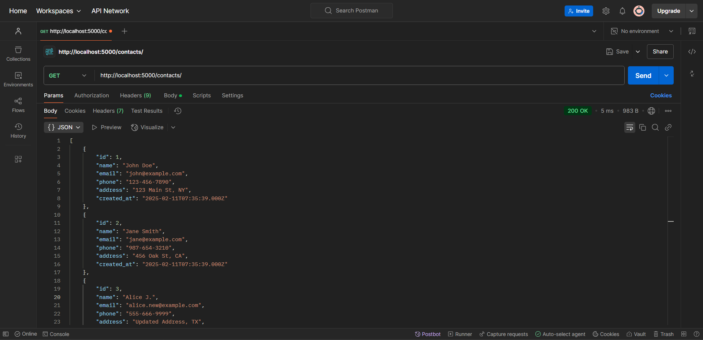
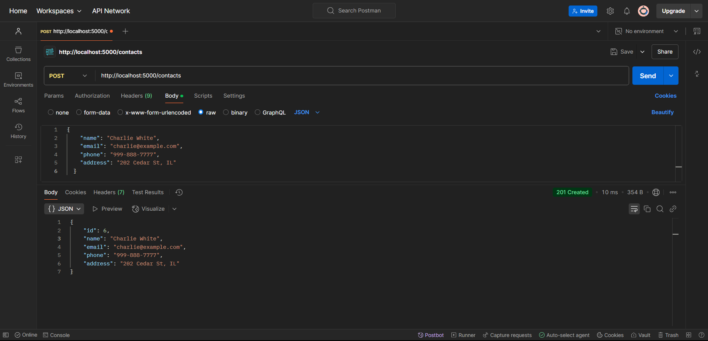
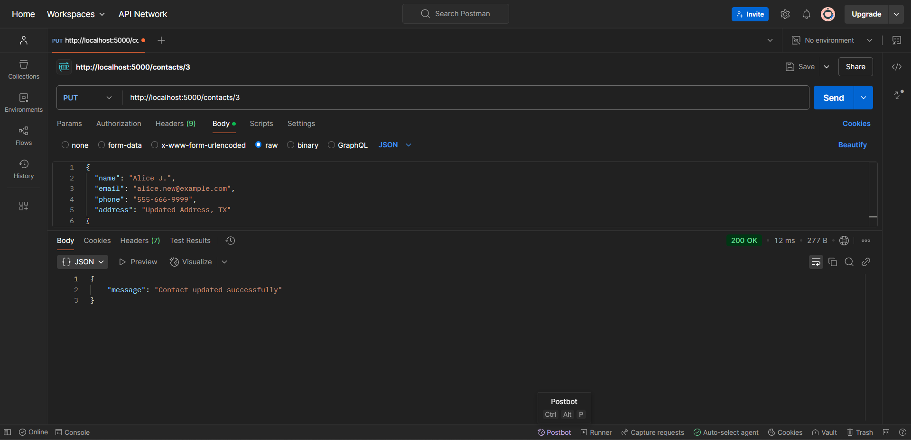
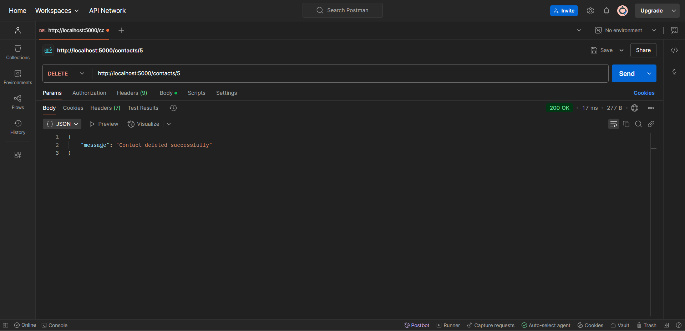

# Contact Management Application Backend

## Overview
This is a Node.js and Express.js backend application for managing contacts. It allows users to add, update, delete, and fetch contacts stored in an SQLite3 database.

## Features
✔️ Fetch all contacts
✔️ Add a new contact
✔️ Get a contact by ID
✔️ Update a contact
✔️ Delete a contact
✔️ Search contacts by name or email
✔️ Input validation using express-validator
✔️ Error handling with proper HTTP status codes

## Technologies Used
- Backend: Node.js, Express.js
- Database: SQLite3
- Validation: express-validator
- Middleware: CORS, body-parser


---

## Installation & Setup

### Prerequisites
- Install **Node.js** & **MySQL** on your system.
- Create a MySQL database.

### Steps to Setup
1. **Clone the Repository**
   ```bash
   git clone https://github.com/your-username/contact-management-api.git
   cd contact-management-api
   ```
2. **Install Dependencies**
   ```bash
   npm install
   ```
3. **Configure Database**
   - Create a MySQL database named `contact_db`.
   - Update `config/db.js` with your MySQL credentials.
   ```javascript
   module.exports = {
     host: "localhost",
     user: "root",
     password: "your_password",
     database: "contact_db",
   };
   ```
4. **Run Database Migrations**
   ```bash
   npm run migrate
   ```
5. **Start the Server**
   ```bash
   npm start
   ```
6. **API will be running at:** `http://localhost:5000`

---

## API Endpoints

### 1. Get All Contacts
**Endpoint:** `GET /contacts`
```http
http://localhost:5000/contacts
```
**Response:**
```json
[
  {
    "id": 1,
    "name": "John Doe",
    "email": "john@example.com",
    "phone": "123-456-7890",
    "address": "123 Main St, NY",
    "created_at": "2024-02-11T10:00:00.000Z"
  },
  {
    "id": 2,
    "name": "Jane Smith",
    "email": "jane@example.com",
    "phone": "987-654-3210",
    "address": "456 Oak St, CA",
    "created_at": "2024-02-11T10:05:00.000Z"
  }
]

```



### 2. Get Single Contact
**Endpoint:** `GET /contacts/:id`
```http
http://localhost:5000/contacts/1
```

### 3. Create a Contact
**Endpoint:** `POST /contacts`
```http
http://localhost:5000/contacts
```
**Request Body:**
```json
{
    "name": "Charlie White",
    "email": "charlie@example.com",
    "phone": "999-888-7777",
    "address": "202 Cedar St, IL"
}
```



### 4. Update a Contact
**Endpoint:** `PUT /contacts/:id`
```http
http://localhost:5000/contacts/3
```
**Request Body:**
```json
{ "message": "Contact updated successfully" }
```


### 5. Delete a Contact
**Endpoint:** `DELETE /contacts/:id`
```http
http://localhost:5000/contacts/5
```



### 6. Search Contacts (By Name or Email)
**Endpoint:** `GET /contacts/search?query=Alice`
```http
http://localhost:5000/contacts/search?query=Alice
```

---

## Dummy Data (For Testing)
Insert these records in `contacts` table before testing:
```sql
INSERT INTO contacts (name, email, phone, address, created_at) VALUES
("Alice Johnson", "alice@example.com", "555-666-7777", "789 Pine St, TX", NOW()),
("Bob Smith", "bob@example.com", "555-444-3333", "123 Oak St, CA", NOW());
```

---

## Folder Structure
```
/contact-management-backend
│── /database
│   ├── database.js
│── /routes
│   ├── contacts.js
│── /controllers
│   ├── contactsController.js
│── server.js
│── README.md
│── package.json

```

---

## Deployment
- Live Demo: The application is hosted on Render.
- Access it here: https://contact-management-api-i4ql.onrender.com
